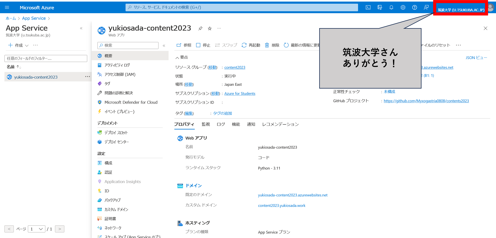

# 🕸 コンテンツ入門2023

名前: 長田悠生

## #コンテンツ入門2023の回収について

### 結論: 銀の弾丸などない （私が調べた限りでは）

正確に表現するならば、裏社会で流通する銀の弾丸（Twitterに対してのスクレイピング行為）は存在する可能性が高い（まだ調べられていない）が、銀の弾丸（公式が認める方法でかつ無償の方法のことを銀の弾丸ということにした）は、私が調べた範囲では存在しなかった。今回、調べた対象の言語は、pythonである。世界には銀の弾丸が存在するかもしれないが、私は見つけることができなかった。

### 以前は、銀の弾丸は存在していた

TwitterのAPI規制が行われる以前は、簡単に行うことができた。しかし、現在のTwitter APIの無料枠では、かなり強い制限がかけられている。

### 弓矢レベルの有効手段はいくつか存在する

twitter-api-clientを用いると、ProアカウントのユーザーのPostのデータであれば、すべてを取得するのは不可能である可能性があるが、取得することはできると思われる。ProアカウントでないユーザのPostのデータを取得できているかどうかは、不明である。(twitter-api-clientの仕組みは、不明)

ちなみに、twitter-api-clientでデータを取得するコードは、以下のような感じ

※以下のコードで、ProアカウントユーザーがカテゴリをTopにしたPostの中で #コンテンツ入門2023 を含むPostデータを取得できると思われる。

```python
from twitter.search import Search

email, username, password = "", "", ""
search = Search(email, username, password, save=True, debug=1)

res = search.run(
    limit=100,
    retries=1,
    queries=[
        {
            'category': 'Top',
            'query': '#コンテンツ入門2023'
        },
    ],
)

```

## 今回行ったこと

### TwitterAPIの無料機能をできるだけ活用した

40個のtweetは面倒なので、TwitterAPIで投稿を一部自動化した。また、投稿内容は、Azureの筑波大学無料枠を利用してAPIサーバーを構築し(正しい無料枠の使い方をしてみた)、jsonのデータとして取得できるようにしている。(通常の無料枠でもできるかもしれないが...)

### 今回作成したコードが入っているrepository


Repository


### 構築したAPIのリンク


APIののURL


### Postを行うコードについて

今回、Postをするにあたって使用したpackageは、tweepyである。

以下の関数で投稿を行える。\
※尚、APIキー等は、settings.pyに格納している。

```python
import tweepy
import settings


client = tweepy.Client(
    consumer_key=settings.CONSUMER_KEY,
    consumer_secret=settings.CONSUMER_SECRET,
    access_token=settings.ACCESS_TOKEN,
    access_token_secret=settings.ACCESS_TOKEN_SECRET,
)

client.create_tweet("")
```

今回は、あえてjson形式でPostしてみた。(完全に気分で行ったので、理由は特にない。)

### APIのコードについて

今回、FastAPIでPostした自分のデータをAPIとして確認できるようにした。

今回作成したAPIのルーティングは、以下のようになっている。

`/`&#x20;

ルートのパスでは、投稿内容をjson形式で一度に取得できる。

`/detail?id=[int]`

detailsのパスパラメータを用いると、n回目に投稿したPostの情報をjson形式で取得できる。

`/nyoki`

ノリで作った。特に意味はない。

```python
from fastapi import FastAPI
import json
from pathlib import Path
from fastapi.responses import FileResponse
from typing import Optional


app: FastAPI = FastAPI()

#/
@app.get("/")
async def index():
    current: Path = Path()
    file_path: Path = current /"data.json"
    return FileResponse(path=file_path)

#/detail?id=int
@app.get("/detail")
async def detail(id: int = 2):
    with open('./data.json', 'r') as f:
        json_load = json.load(f)
    return json_load['data'][id-1]

#/nyoki
@app.get("/nyoki")
async def halloween():
    return {'にょき': '·*·:≡( ε:)'}
```

### Azureでのホストについて

今回、FastAPIを用いて作成したAPIのスクリプトは、Azureで走らせている。筑波大学のAzure無償提供という寛大さに手を合わせつつ、App Serviceを利用してホストしている。(通常の無料枠でもできるかもしれないが...)

<figure><figcaption><p>Azureのの画面</p></figcaption></figure>
