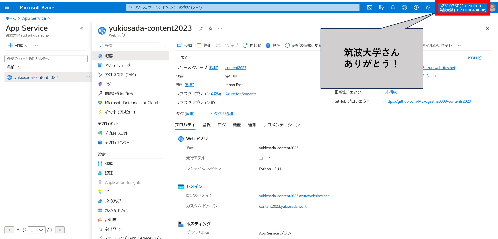

# 🕸 コンテンツ入門2023

名前: 長田悠生

## #コンテンツ入門2023の回収について

### 結論: 銀の弾丸などない

正確に表現するならば、裏社会で流通する銀の弾丸(Twitterに対してのスクレイピング行為)は存在するが、銀の弾丸(公式が認める方法でかつ無償の方法)は存在しない。今回、調査した対象の言語は、pythonである。

### 以前は、銀の弾丸は存在していた

TwitterのAPI規制が行われる以前は、特定ハッシュタグの埋め込みができるhtmlタグを吐き出すサービスが公式で提供されるレベルで簡単に行うことができた。しかし、現在のTwitter APIの無料枠では、PostとDeleteのみが提供されており、回数制限もかなり強い縛りがかけられている。

### 弓矢レベルの有効手段はいくつか存在する

PyAutoGUIを用いて、検索までをpythonに自動化させ、検索結果ページのhtmlのタグを取得することで可能だが、面倒くさい。また、twitter-api-clientを用いると、Proアカウントのユーザー情報のみであれば取得することができる。(twitter-api-clientは、おそらく一部でスクレイピングを行っているため、弓矢レベルでもないかもしれない。)

ちなみに、twitter-api-clientでデータを取得するコードは、以下のような感じ

※以下のコードで、ProアカウントユーザーがカテゴリをTopにしたPostの中で #コンテンツ入門2023 を含む投稿をしたユーザー情報を取得できる。

```python
from twitter.search import Search

email, username, password = "", "", ""
search = Search(email, username, password, save=True, debug=1)

res = search.run(
    limit=100,
    retries=1,
    queries=[
        {
            'category': 'Top',
            'query': '#コンテンツ入門2023'
        },
    ],
)

```

## 今回行ったこと

### TwitterAPIの無料機能をできるだけ活用した

40個のtweetは面倒なので、TwitterAPIで投稿を自動化した。また、投稿内容は、Azureの筑波大学無料枠を利用してAPIサーバーを構築し(正しい無料枠の使い方をしてみた)、jsonのデータとして取得できるようにしている。

### 今回作成したコードが入っているrepository


Repository


### 構築したAPIのリンク


APIののURL


### 自動Postを行うコードについて

今回、自動Postをするにあたって使用したpackageは、tweepyである。

以下の関数で投稿を行える。\
※尚、APIキー等は、settings.pyに格納している。

```python
import tweepy
import settings


client = tweepy.Client(
    consumer_key=settings.CONSUMER_KEY,
    consumer_secret=settings.CONSUMER_SECRET,
    access_token=settings.ACCESS_TOKEN,
    access_token_secret=settings.ACCESS_TOKEN_SECRET,
)

client.create_tweet("")
```

今回は、あえてjson形式でPostしてみた。(完全に気分で行ったので、理由は特にない。)

### APIのコードについて

今回、FastAPIでPostした自分のデータをAPIとして確認できるようにした。

今回作成したAPiのルーティングは、以下のようになっている。

`/`&#x20;

ルートのパスでは、投稿内容をjson形式で一度に取得できる。

`/detail?id=[int]`

detailsのパスパラメータを用いると、n回目に投稿したPostの情報を切り取った形でjson形式で取得できる。

`/nyoki`

ノリで作った。特に意味はない。(エンジニアに最も大切な精神は、遊び心だという偉大な思想に基づいて作っている。)

```python
from fastapi import FastAPI
import json
from pathlib import Path
from fastapi.responses import FileResponse
from typing import Optional


app: FastAPI = FastAPI()

#/
@app.get("/")
async def index():
    current: Path = Path()
    file_path: Path = current /"data.json"
    return FileResponse(path=file_path)

#/detail?id=int
@app.get("/detail")
async def detail(id: int = 2):
    with open('./data.json', 'r') as f:
        json_load = json.load(f)
    return json_load['data'][id-1]

#/nyoki
@app.get("/nyoki")
async def halloween():
    return {'にょき': '·*·:≡( ε:)'}
```

### Azureでのホストについて

今回、FastAPIを用いて作成したAPIのスクリプトは、Azureで走らせている。筑波大学のAzure無償提供という寛大さに手を合わせつつ、App Serviceを利用してホストしている。

<figure><figcaption><p>Azureの画面</p></figcaption></figure>

